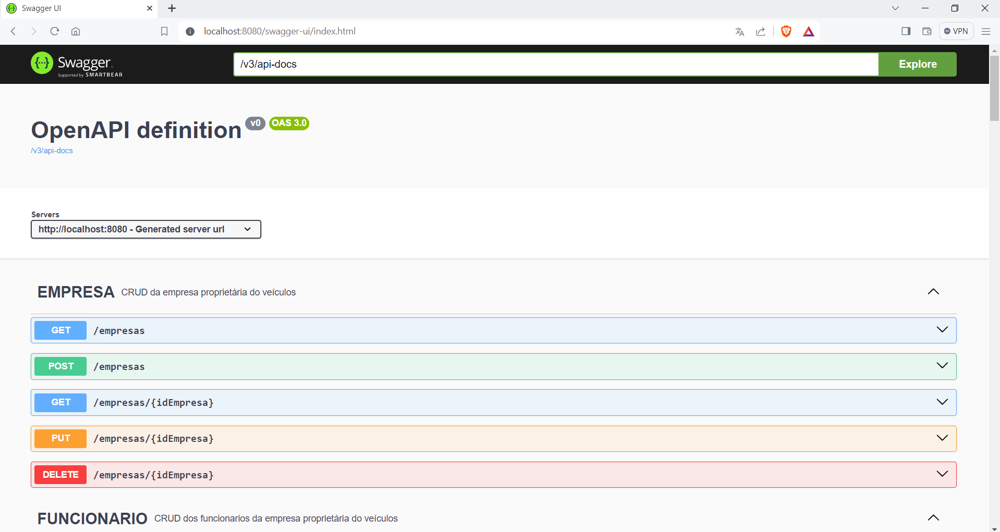

<h1 align="center">API-SGNC-SPRING REST</h1>
<h3 align="center">Sistema de Gestão de Não Conformidade</h3>

O sistema consiste no registro de não conformidades e avarias encontradas na frota de ônibus, catalogando tanto as não conformidades quanto as medidas que 
foram utilizadas para que a mesma fosse restaurado.

As técnologias utilizadas são: 
  <table>
    <thead>
        <tr>
          <th>Tecnologia  </th>
          <th> Versão  </th>
       </tr>
    </thead>
    <tbody>
      <tr>
        <td>Java</td>
        <td>17</td>
      </tr>
      <tr>
        <td>Spring Boot</td>
        <td>3.2.2</td>
      </tr>
      <tr>
        <td>MySQL</td>
        <td>8.0</td>
      </tr>
    </tbody>
  </table>
  
<!--    -->

